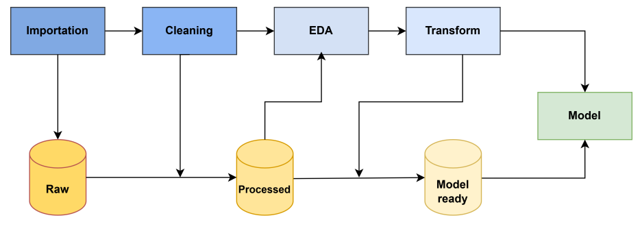

# Movie Recommender System (TFG)

*[Leer en español](README.md)*

Bachelor's thesis (TFG) project that builds and compares a movie recommender system on the **MovieLens 100K** dataset, enriched with content information obtained from the **TMDB** API. Three families of approaches are implemented and evaluated: content-based filtering, collaborative filtering, and hybrid models.

> 📄 **Full thesis report (in Spanish):** [documentos/Memoria_proyecto.pdf](documentos/Memoria_proyecto.pdf)



## Project goal

The project consists of testing, comparing and evaluating different filtering algorithms and methods for generating movie recommendations, training and evaluating them on the same dataset and the same train/val/test splits so their results can be compared consistently. Specifically, it explores:

- **Content-based filtering**: recommends similar movies based on their textual information (overview, genres, tags), using TF-IDF and SBERT embeddings.
- **Collaborative filtering**: recommends based on users' rating history, without using content information, using KNN (memory-based), SVD (matrix factorization) and neural collaborative filtering (NCF).
- **Hybrid models**: combine content and collaborative signals (via regression, rank fusion or neural networks) to try to improve on each approach on its own.

The results for each algorithm are collected and compared in the [Results](#results-rmse-on-test) section.

## Data sources

- **MovieLens 100K** (https://grouplens.org/datasets/movielens/): ratings, tags, movies and links, with ~100,000 ratings from 610 users on about 9,700 movies.
- **TMDB** (https://developer.themoviedb.org/reference/intro/getting-started): overview, tagline, genres, popularity, budget, revenue, runtime, etc., obtained via calls to its API using each movie's `tmdbId` (from `links.csv`).

## Project structure

The project follows a sequential pipeline of Jupyter notebooks, numbered by stage:

```
01_importation/   Download of the raw data (MovieLens + TMDB API)
02_cleaning/      Cleaning, validation and referential integrity of each dataset
03_EDA/           Exploratory analysis of the already validated data
04_transform/     Construction of the datasets ready for model training
05_model/         Training and evaluation of the recommendation models
data/             Raw, processed and model-ready data (not versioned)
documentos/       Thesis report and project diagram
logs/             Execution logs (e.g. TMDB API errors)
```

### 01_importation

- **importation.ipynb**: downloads the MovieLens (100K) data and, for each movie, calls the TMDB API using the `tmdbId` from `links.csv`. Each response is saved as an individual JSON file in `data/01_raw/TMDB`. Failed requests are logged in `logs/requestTMDB.log`. Requires a TMDB token in the `TMDB_TOKEN` environment variable (see [Setup](#setup)).

### 02_cleaning

One cleaning/validation notebook per MovieLens dataset, plus a final one that cross-checks all sources:

| Notebook | Dataset | What it does |
|---|---|---|
| `clean_movies.ipynb` | movies.csv | Validates movieId and genres, splits the year out of the title, flags missing genre as null |
| `clean_ratings.ipynb` | ratings.csv | Validates uniqueness, date range and rating scale; converts the timestamp to a date |
| `clean_tags.ipynb` | tags.csv | Validates nulls and dates; normalizes the tag text |
| `clean_links.ipynb` | links.csv | Validates movieId/tmdbId; cross-checks against the API error log; drops imdbId |
| `clean_TMDB.ipynb` | TMDB JSON files | Consolidates the individual JSON files into a single dataset with the relevant columns |
| `intengridadRefencial.ipynb` | the 5 above | Cross-checks all the already-cleaned datasets and removes orphan records (movies without TMDB data, without a genre in either system, etc.), ensuring they all share the same set of `movieId`/`userId` |

Output: `data/02_processed/*_clean.parquet` and `data/02_processed/*_integrity.parquet`.

### 03_EDA

- **eda.ipynb**: exploratory analysis on the already validated data: rating distribution per user and per movie, evolution over time, genre distribution (TMDB vs. MovieLens), and analysis of the sparsity of the user-movie matrix (~98.3%), which shapes the design of the collaborative models.

### 04_transform

Builds the final datasets consumed by the models:

- **PLN.ipynb**: aggregates the tags per movie, combines title, genres, tags and TMDB overview into a single text per movie → `data/03_model_ready/NLP.parquet` (used by the TF-IDF and SBERT content-based models).
- **ratings.ipynb**: splits the ratings into train/val/test, temporally and per user (70/15/15) → `data/03_model_ready/ratings_{train,val,test}.parquet` (used by all collaborative and hybrid models).
- **hybrid.ipynb**: combines TMDB variables (popularity, vote_average, vote_count, runtime) and MovieLens variables (year, genres multi-hot encoded) with the ratings → `data/03_model_ready/hybrid.parquet` (used by the neural-network-based hybrid models).

### 05_model

The models are organized into three families, each in its own subfolder:

**01_content_based** — filtering based on movie content (overview, tags, genres):
- `TFIDF.ipynb`: TF-IDF vectorization (with spaCy preprocessing: lemmatization and stopwords) + cosine similarity.
- `SBERT.ipynb`: sentence-transformers embeddings (`all-MiniLM-L6-v2`) + cosine similarity.

**02_collaborative** — collaborative filtering, based solely on ratings:
- `KNNitem.ipynb` / `KNNuser.ipynb`: memory-based KNN (KNNBasic, KNNWithMeans, KNNBaseline from `surprise`), in item-based and user-based variants.
- `SVD.ipynb`: matrix factorization with and without bias terms, compared against a baseline model.
- `RNcol.ipynb` / `RNcolADAM.ipynb`: neural collaborative filtering (NCF) with user/movie embeddings, trained with SGD and with Adam respectively.

**03_hybrid** — combination of the two previous families:
- `hybrid.ipynb`: combines SVD and SBERT, first via linear regression and then by fusing their rankings with Reciprocal Rank Fusion (RRF), compared against popularity and random recommendations.
- `RNhybrid.ipynb`: NCF network that adds TMDB content variables to the user/movie embeddings, with interpretability analysis (SHAP) and error analysis by movie popularity.
- `RNhybridMenosVar.ipynb`: same network, with fewer content variables, to assess their actual contribution.

#### Results (RMSE on test)

| Model | RMSE |
|---|---|
| RNhybrid (NCF + TMDB variables, Adam) | **≈0.847** |
| SVD with biases | ≈0.861 |
| RNhybridMenosVar (NCF + fewer variables) | ≈0.870 |
| BaselineOnly (user/movie biases only) | ≈0.886 |
| RNcolADAM (pure NCF, Adam) | ≈0.890 |
| KNNBaseline item-based | ≈0.883 |
| KNNBaseline user-based | ≈0.906 |
| SVD without biases | ≈0.919 |
| RNcol (pure NCF, SGD) | ≈1.058 |

The content-based models (TF-IDF, SBERT) and the SVD+SBERT hybrid are evaluated separately with precision/recall@10, since they don't predict a rating directly; the full detail of all metrics is in each notebook and in the report.

## Setup

Requires Python 3.11 and [uv](https://docs.astral.sh/uv/) as the dependency manager. The project's dependencies are defined in [pyproject.toml](pyproject.toml) (exact versions pinned in [uv.lock](uv.lock)), both at the repository root.

```bash
uv sync
```

To run `01_importation/importation.ipynb` you need a `.env` file at the project root with a TMDB token:

```
TMDB_TOKEN=your_tmdb_token
```

## Data

The `data/` folder is not versioned in git (only its folder structure, via `.gitkeep` files): it needs to be generated by running the pipeline from `01_importation` onward, or by manually copying the data files into:

```
data/01_raw/movieLens/    (movies.csv, ratings.csv, tags.csv, links.csv)
data/01_raw/TMDB/         (one .json file per movie)
data/02_processed/        (generated by 02_cleaning)
data/03_model_ready/      (generated by 04_transform)
```
